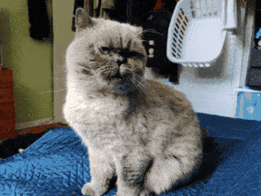

# Style Transfer
[![Python][Python-badge]][Python-url]
[![Pytorch][Pytorch-badge]][Pytorch-url]

<!-- Improved compatibility of back to top link: See: https://github.com/othneildrew/Best-README-Template/pull/73 -->
<a name="readme-top"></a>

Trained a neural network to learn the styles from one image, and apply them against a given image. Based off the style transfer paper [Gatys et al (2016)](https://www.cv-foundation.org/openaccess/content_cvpr_2016/papers/Gatys_Image_Style_Transfer_CVPR_2016_paper.pdf) where using a VGG network, style can be extracted. 

This is done by looking at specific layers inside the feature extractors of the network and using them to grab the important features of the network. This is then used to create a loss against a target image. This loss is then minimized by slowly modifiying the target image using a gram matrix. The more iterations, the more stylized the image becomes.

In [Gatys et al (2016)](https://www.cv-foundation.org/openaccess/content_cvpr_2016/papers/Gatys_Image_Style_Transfer_CVPR_2016_paper.pdf), there were a multitude of experiements that were conducted, but the most successfull was used in this repository. To see other experiemnts and how they faired against each other please see the research paper.


<!-- TABLE OF CONTENTS -->
<details>
  <summary>Table of Contents</summary>
  <ol>
    <li>
      <a href="#about-the-code">About The Code</a>
      <ul>
        <li><a href="#training">Training</a></li>
        <li><a href="#feature-visualization-creation">Feature Visualization Creation</a></li>
        <li><a href="#validation">Validation</a></li>
      </ul>
    </li>
    <li>
      <a href="#getting-started">Getting Started</a>
      <ul>
        <li><a href="#prerequisites">Prerequisites</a></li>
        <li><a href="#installation">Installation</a></li>
      </ul>
    </li>
    <li>
      <a href="#usage">Usage</a>
      <ul>
        <li><a href="#feature-visualization-creation--validation">Feature Visualization Creation / Validation</a></li>
        <li><a href="#training-models">Training-Models</a></li>
      </ul>
    </li>
  </ol>
</details>

<!-- GRID OF COOL IMAGES -->
<p align="center">
  
  
  
</p>

<!-- ABOUT THE CODE-->
## About The Code

The code is broken into two files

* [helpers.py](helpers.js)
  * Gram matrix code
  * Feature extraction
  * Image loading
  * Image converting
* [main.py](main.py)
  * Getting Features of Style
  * Style transfer image creation / Model Training
  * Gif creation

<!-- GETTING STARTED -->
## Getting Started
To get a local copy up and running follow these simple steps.

### Prerequisites

Make sure to have these installed at a minimum
* Python ( version >= 3)
* Pytorch (CUDA enabled if possible)
* Jupyter (Notebook or Lab)
* Pip (Comes with python versions >= 3.4)

### Installation

1. Clone the repo
   ```sh
   git clone git@github.com:baxtrax/style-transfer.git
   ```
2. Go to where cloned and install required modules via the [requirements.txt](requirements.txt) file
   ```sh
   pip install -r requirements.txt
   ```

<p align="right">(<a href="#readme-top">back to top</a>)</p>

<!-- USAGE EXAMPLES -->
## Usage
### Style Transfer / Gif Creation
See [main.py](main.py)
  1. (Optional) Add your own style image and source image in the [images](images) folder
  2. Make modifications as nessessary and run
     ```sh
     python main.py
     ```
<p align="right">(<a href="#readme-top">back to top</a>)</p>
